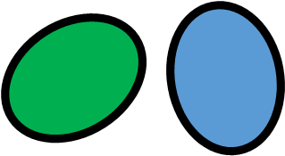

# Volume Metrics and Their Ratios
- Only Meaningful for "Shared" Relationships (Equal, Contains, Partitioned, Overlaps)
- Volume Metrics can be applied to situations with > 2 structures, but are then not tied to a relationship.

<link rel="stylesheet" href="../relations.css">

## Color Coding
<table style="border: 2px solid black; width=50px;"><tr><td>
<ul style="font-weight: 900; font-size: 20px;">
<li style="color: blue;">Structure A</li>
<li style="color: green;">Structure B</li>
<li style="color: orange;">intersection of a & b</li></ul>
</tr></td></table>

## Volume Metrics
<table width="450px">
<tr><th>Structures</th><th>Union</th><th>Intersection</th><th>Difference</th></tr>
<tr>
<td></td>
<td></td>
<td></td>
<td></td>
</tr></table>

### EQUAL
<table width="450px">
<tr class="l"><th>EQUAL</th><th>Shared</th><th>Symmetric, Transitive</th></tr>
<td class="d" colspan="3">
The interiors of A and B
intersect and no part of the interior of one geometry intersects the exterior of the other.
</td></tr>
<tr><td>

</td>
<td colspan="2"> Union = Intersection = VA = VB  Difference = 0</td>
</tr></table>

### CONTAINS
<table width="450px">
<tr class="l"><th>CONTAINS / WITHIN</th><th>Shared</th><th>Transitive</th></tr>
<td class="d" colspan="3">
All points of B lie in the interior of A, no points of B lie in the exterior of A, some points in A are exterior to B, and the boundaries of A and B do not intersect.
</td></tr>
<tr><td>

</td>
<td colspan="2">
Union = VA 
Intersection = VB 
Difference =VA - VB</td>
</tr>
</table>

### PARTITIONED
<table width="450px">
<tr class="l"><th>PARTITIONED / PARTITIONS</th><th>Shared</th><th></th></tr>
<td class="d" colspan="3">
All points of B lie in the interior of A,
no points of B lie in the exterior of A,
some points in A are exterior to B,
and the boundaries of A and B have more than one point in common.
</td></tr>
<tr><td>

</td>
<td colspan="2">
Union = VA 
Intersection = VB 
Difference =VA - VB</td>
</td>
</tr></table>

### OVERLAPS
<table width="450px">
<tr class="l"><th>OVERLAPS</th><th>Shared</th><th>Symmetric</th></tr>
<td class="d" colspan="3">
A and B
have some but not all points in common.
</td></tr>
<tr><td>

</td>
<td colspan="2">
VA + VB > Union 
VA > Intersection 
VB > Intersection 
Difference > 0</td>
</tr></table>

### BORDERS
<table width="450px">
<tr class="l"><th>BORDERS</th><th>Adjoining</th><th>Symmetric</th></tr>
<td class="d" colspan="3">
The exterior boundaries of A and B
have more than one point in common, but their interiors do not intersect.
</td></tr>
<tr><td>

</td>
<td colspan="2">
Union = VA + VB 
Intersection = 0 
Difference = 0</td>
</tr></table>

### CONFINES (Interior Borders)
<table width="450px">
<tr class="l"><th>CONFINES / CONFINED</th><th>Adjoining</th><th></th></tr>
<td class="d" colspan="3">
Part of the interior boundary of A and
the exterior boundary of B have more than one point in common
but their interiors do not intersect.
</td></tr>
<tr><td>

</td>
<td colspan="2">
Union = VA + VB 
Intersection = 0 
Difference = 0</td>
</tr></table>

### SURROUNDS
<table width="450px">
<tr class="l"><th>SURROUNDS / ENCLOSED</th><th>Separate</th><th>Transitive</t></tr>
<td class="d" colspan="3">
A and B have no interior points in common, but the Exterior of A (A with its holes of filled) contains B.
</td></tr><tr><td>

</td>
<td colspan="2">
Union = VA + VB 
Intersection = 0 
Difference = 0</td>
</tr></table>

### SHELTERS
<table width="450px">
<tr class="l"><th>SHELTERS / SHELTERED</th><th>Separate</th><th>Transitive</t></tr>
<td class="d" colspan="3">
A and B have no points in common,
but the Convex Hull around A contains B.
</td></tr><tr><td>

</td>
<td colspan="2">
Union = VA + VB 
Intersection = 0 
Difference = 0</td>
</tr></table>

### DISJOINT
<link rel="stylesheet" href="relations.css">
<table width="450px">
<tr class="l"><th>DISJOINT</th><th>Separate</th><th>Symmetric</th></tr>
<td class="d" colspan="3">The Convex Hull around A
has no points in common with B.
</td></tr>
<tr><td>

</td>
<td colspan="2">
Union = VA + VB 
Intersection = 0 
Difference = 0</td>
</tr></table>

## Volume Ratios
### Possible Ratios
- Intersection / Union (Range: 0 to 1)
- Difference / Union (Range: 0 to 1)
- Intersection / Difference (Range: 0 to infinity)

- *OVERLAPS* only
  - VA / Union (Range: 0 to 1)
  - Intersection / VA (Range: 0 to 1)
  - VB / VA (Range: 0 to 1)
  - Difference / VA (Range: 0 to 1)

- Only implement these two to begin with.
  Others can be implemented later by editing Json file with Ratio definitions.
  - Intersection / Union
  - Difference / Union (= 1 - Intersection / Union for *CONTAINS* and *PARTITIONED*)

**Note:** For *CONTAINS* & *PARTITIONED*
  - Union = VA
  - Intersection = VB
  - Difference =VA - VB
